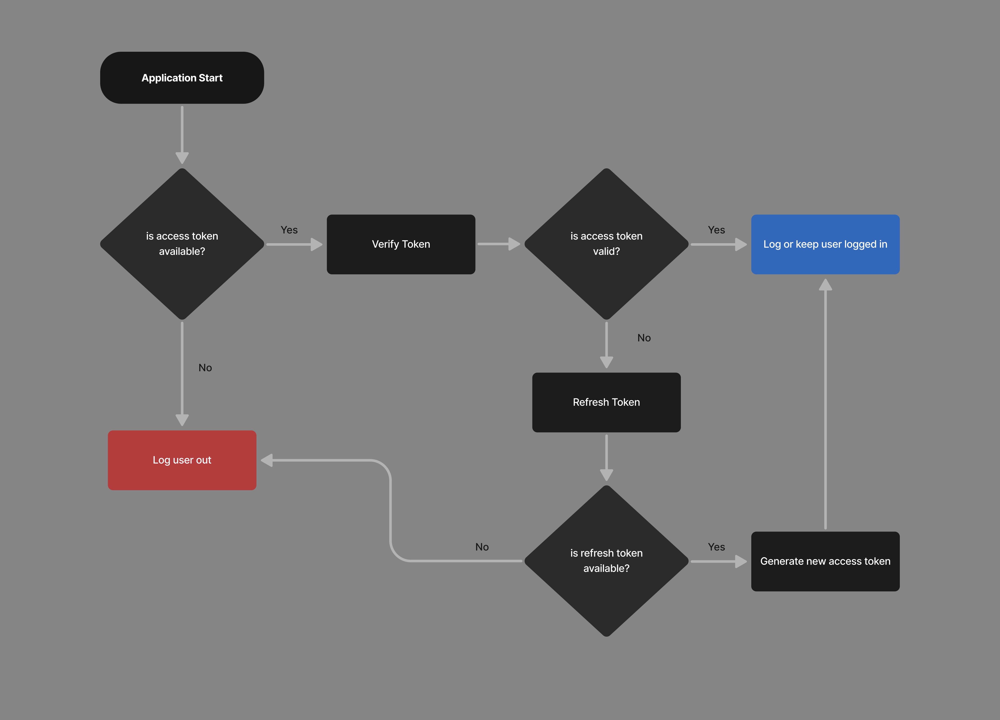
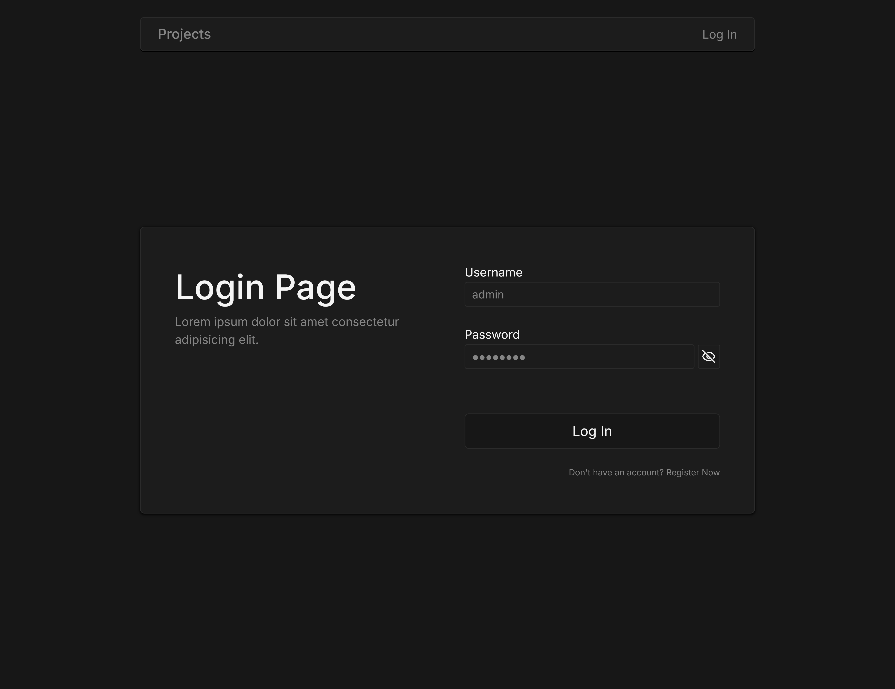
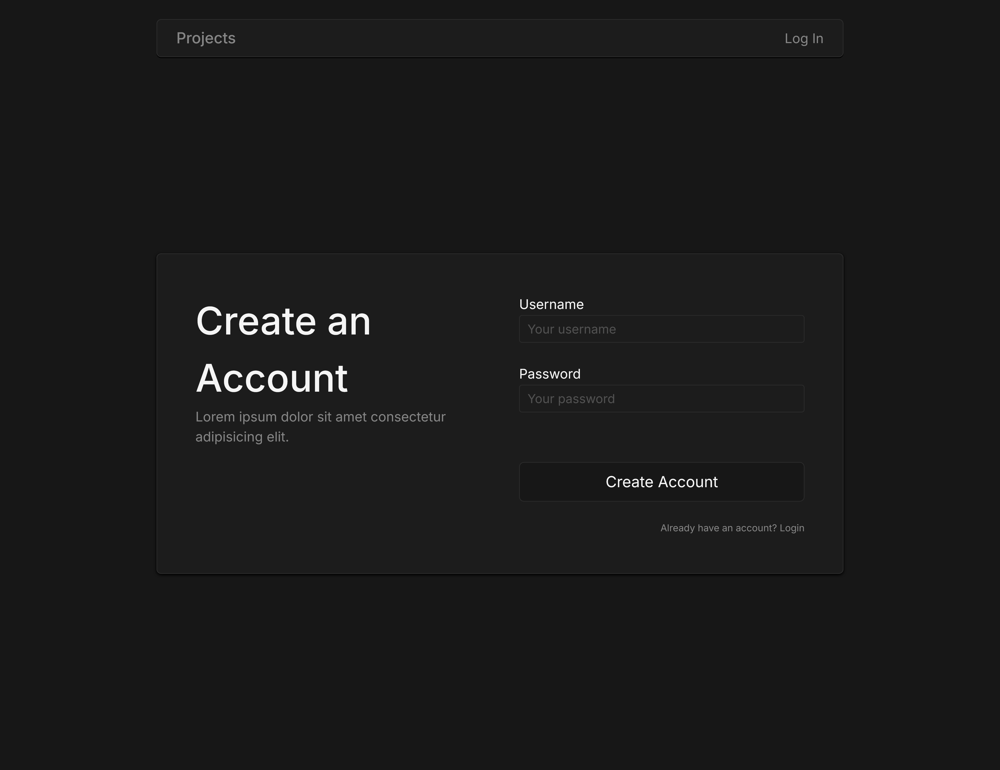
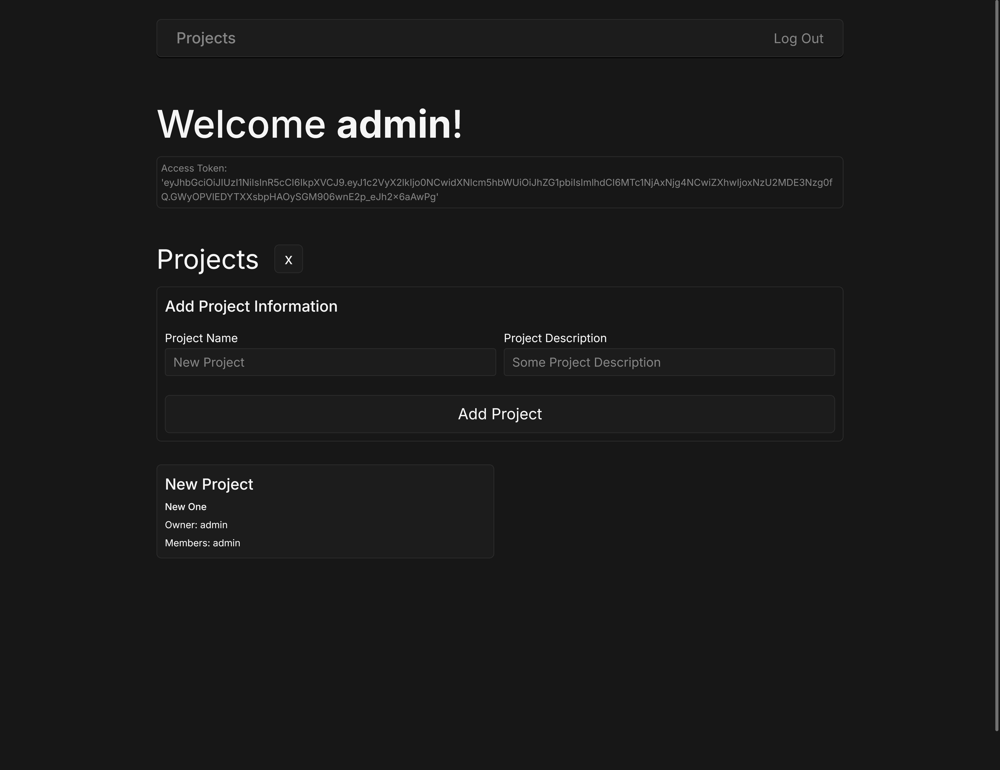

# Authentication System
**Built with ReactJS, Node.js, Express, and MySQL**  

A personal practice project demonstrating how to implement an authentication system, including login, signup, token verification, and refresh token handling. The frontend is built with React, while the backend uses Node.js with Express and MySQL for data storage.

## ✨ Flow Diagram  
This diagram represents how the authentication system works. When the app starts, it first checks if the user is logged in by looking for an existing access token. If an access token is found, it is verified to ensure it has not expired. If the token is still valid, the user remains logged in. If the token has expired, the system calls the refresh function. If a refresh token exists, a new access token is generated and the user stays logged in. If no refresh token is available, the user is logged out. 

- The same flow can be applied to a fetchWithAuth function to check and refresh token validity when action or API call is done to keep the user logged in.
  

## ✨ Project UI for the Practice 
  
  
  
